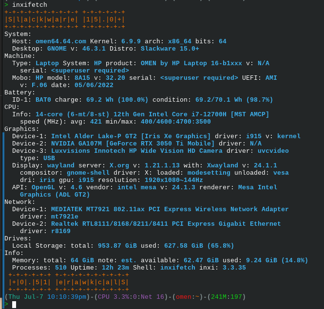

# inxifetch
inxifetch is an [inxi](https://codeberg.org/smxi/inxi) plugin and need [figlet](http://www.figlet.org/) to run properly<br>
### Required:
```
inxi
figlet
```
### Installation
1. Just download and install in your $PATH `inxifetch` script and make it executable. 
2. Create a folder `/etc/inxifetch` download and place there `inxifetch.conf`
3. Thats all!


### Usage

```inxifetch```

Output is:<br> 


You can modify `etc/inxifetch/inxifetch.conf` as you want to play with custom colors and fonts... <br>
<b>Examples:</b><br>

<br>

<br>

<br>


<br>Also you can use **all** ```inxi -options``` for more special output.   <br>
something like `inxifetch Fxx`<br>

<br>
OR `inxifetch r`<br>


--------------------------------------------------------------------------------
#### DONATE
--------------------------------------------------------------------------------
I do not accept donations, but if you want to make a donation please donate to **original inxi developer**:<br>
Help support the inxi project with a one time or a sustaining donation.

Paypal: https://www.paypal.com/donate/?hosted_button_id=77DQVM6A4L5E2

LiberaPay (sustaining donations): https://liberapay.com/smxi/<br>

Or to **figlet project**: http://www.figlet.org/

#### Have Fun


